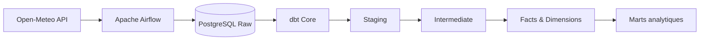
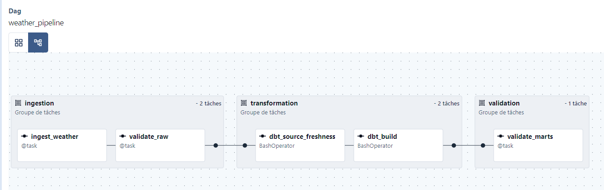
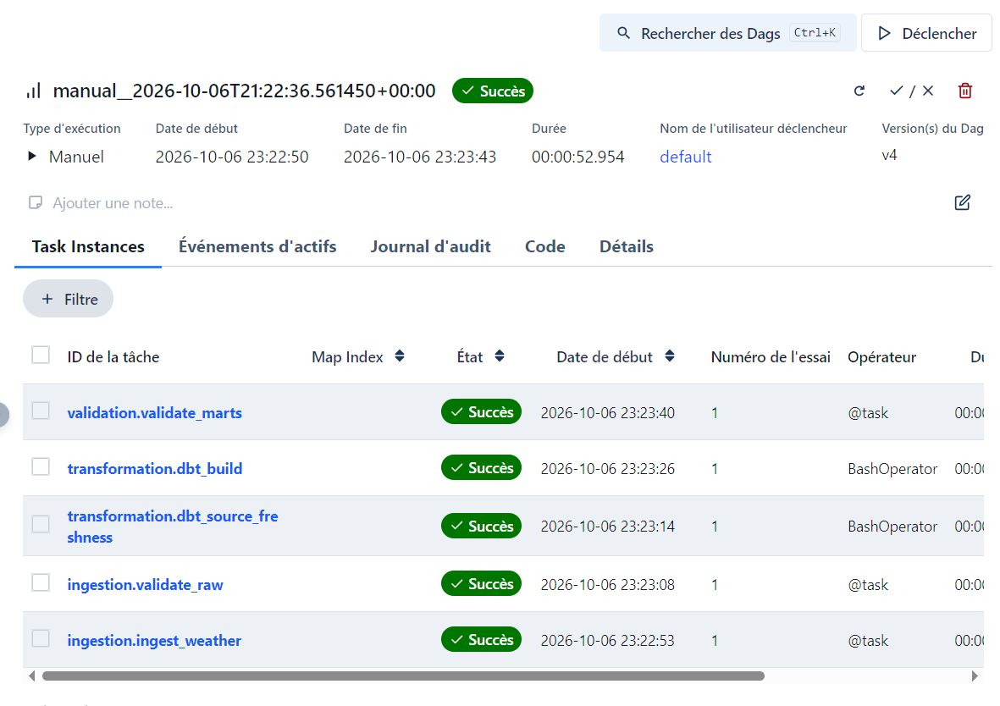
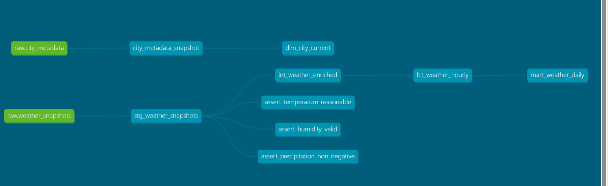
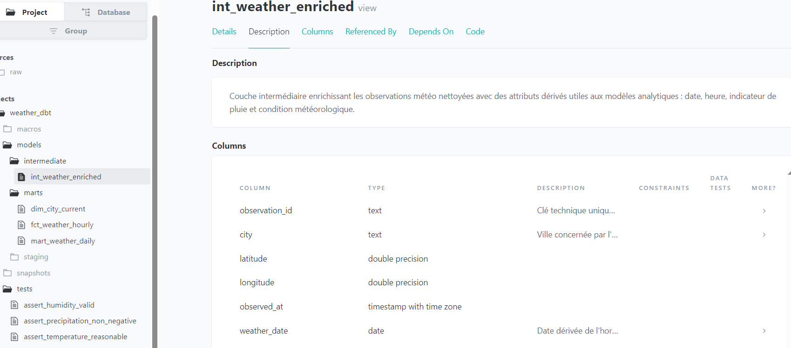

# Weather Data Platform

Plateforme de données météo construite avec **Apache Airflow, dbt Core, PostgreSQL et Docker Compose**.

Le projet collecte régulièrement des observations météorologiques depuis l’API publique **Open-Meteo**, les charge dans PostgreSQL, orchestre le pipeline avec Airflow, puis transforme, teste et documente les données avec dbt.

L’objectif est de mettre en œuvre un pipeline Data Engineering reproductible couvrant l’ingestion, l’orchestration, la transformation, la qualité des données, l’historisation et le lineage.

---

## Architecture



**Airflow** orchestre les grandes étapes opérationnelles du pipeline.

**dbt** gère les transformations SQL, les dépendances entre modèles, les tests, les snapshots et la documentation.

---

## Pipeline Airflow

Le DAG `weather_pipeline` est planifié toutes les heures.

```text
INGESTION
├── ingest_weather
└── validate_raw
        ↓
TRANSFORMATION
├── dbt_source_freshness
└── dbt_build
        ↓
VALIDATION
└── validate_marts
```

### Ingestion

La task `ingest_weather` :

- interroge Open-Meteo pour plusieurs villes dans un seul appel HTTP ;
- contrôle la réponse de l’API ;
- charge les observations météo dans PostgreSQL ;
- met à jour les métadonnées des villes ;
- utilise un `PostgresHook` et une Connection Airflow ;
- utilise des UPSERT avec `ON CONFLICT` pour garantir l’idempotence ;
- retourne uniquement de petites métadonnées d’orchestration via XCom.

Les données métier ne transitent pas par XCom : elles sont écrites directement dans PostgreSQL.

### Validation opérationnelle

Airflow vérifie notamment :

- que toutes les villes attendues ont été chargées ;
- que la couche raw contient bien les données ;
- que les tables finales produites par dbt ne sont pas vides.

La task d’ingestion dispose également de retries et d’un timeout d’exécution.

Un `on_failure_callback` centralise la gestion des échecs et pourrait être connecté en production à Slack, Teams, PagerDuty ou un autre système d’alerting.

---

## Transformations dbt

Le projet dbt suit une architecture en plusieurs couches.

```text
raw.weather_snapshots
        ↓
stg_weather_snapshots
        ↓
int_weather_enriched
        ↓
fct_weather_hourly
        ↓
mart_weather_daily
```

Une seconde branche permet d’historiser les métadonnées des villes :

```text
raw.city_metadata
        ↓
city_metadata_snapshot
        ↓
dim_city_current
```

### Staging

`stg_weather_snapshots`

- renomme et normalise les colonnes de la source raw ;
- génère une clé technique unique par observation ;
- expose une structure propre pour les transformations suivantes.

### Intermediate

`int_weather_enriched`

Ajoute des attributs dérivés :

- date de l’observation ;
- heure de l’observation ;
- indicateur de pluie ;
- condition météorologique normalisée.

La traduction des codes météo est centralisée dans une macro dbt personnalisée.

### Table de faits incrémentale

`fct_weather_hourly`

Le modèle est matérialisé en `incremental` avec :

- une `unique_key` ;
- une stratégie `MERGE` ;
- une fenêtre de recouvrement de deux heures.

Cette fenêtre permet de retraiter les données récentes en cas de correction ou de nouvelle ingestion.

### Mart quotidien

`mart_weather_daily`

Produit des indicateurs quotidiens par ville :

- température minimale ;
- température maximale ;
- température moyenne ;
- humidité moyenne ;
- précipitations cumulées ;
- vitesse moyenne du vent ;
- nombre d’observations.

---

## Historisation avec dbt Snapshot

`raw.city_metadata` contient uniquement l’état courant des métadonnées des villes.

Le snapshot `city_metadata_snapshot` permet de conserver les différentes versions successives d’une ville selon une logique **SCD Type 2**.

Il devient ainsi possible de connaître :

- la valeur actuelle ;
- les anciennes versions ;
- la période de validité de chaque version.

Le modèle `dim_city_current` conserve uniquement la version actuellement valide de chaque ville.

---

## Qualité des données

Le projet combine plusieurs niveaux de contrôle.

### Contrôles Airflow

Airflow vérifie le bon déroulement opérationnel de l’ingestion et la présence des données attendues avant de poursuivre le pipeline.

### Tests dbt

Le projet comprend des tests génériques et des tests SQL personnalisés :

- `not_null` ;
- `unique` ;
- humidité comprise entre 0 et 100 % ;
- précipitations non négatives ;
- températures comprises dans une plage raisonnable.

Un test dbt en échec provoque un code de retour non nul de `dbt build`.

Airflow marque alors la task correspondante en échec et bloque les traitements aval.

### Source freshness

dbt contrôle également la fraîcheur de la source météo grâce au champ `ingested_at`.

---

## Fonctionnalités dbt mises en œuvre

- `source()`
- `ref()`
- staging / intermediate / marts
- vues et tables
- modèle incrémental
- stratégie `MERGE`
- tests génériques
- tests SQL personnalisés
- source freshness
- macro personnalisée
- package `dbt_utils`
- génération de clé technique
- snapshot
- SCD Type 2
- dbt Docs
- lineage

---

## Fonctionnalités Airflow mises en œuvre

- `@dag`
- TaskFlow API
- `@task`
- `BashOperator`
- `PostgresHook`
- Connections Airflow
- XCom
- retries
- timeout
- TaskGroups
- callback d’échec
- planification horaire
- ingestion idempotente
- orchestration de dbt

---

## Structure du projet

```text
weather-data-platform/
├── airflow/
│   ├── dags/
│   │   └── weather_pipeline.py
│   ├── config/
│   ├── logs/
│   └── plugins/
│
├── dbt/
│   ├── macros/
│   ├── models/
│   │   ├── staging/
│   │   ├── intermediate/
│   │   └── marts/
│   ├── snapshots/
│   ├── tests/
│   ├── dbt_project.yml
│   └── packages.yml
│
├── dbt_profiles/
│   └── profiles.yml
│
├── sql/
│   └── bootstrap_raw.sql
│
├── docs/
├── Dockerfile
├── docker-compose.yml
├── .env.example
└── README.md
```

---

## Installation

### Prérequis

- Docker Desktop
- Docker Compose
- Git

Le projet a été développé avec WSL2 sous Windows.

### 1. Cloner le projet

```bash
git clone <URL_DU_REPOSITORY>
cd weather-data-platform
```

### 2. Créer le fichier d’environnement

```bash
cp .env.example .env
```

Remplacer ensuite les valeurs `replace_me` par des secrets locaux.

Le fichier `.env` réel est exclu de Git.

### 3. Construire l’image Airflow

```bash
docker compose build
```

L’image personnalisée installe dbt Core et l’adapter PostgreSQL dans un environnement Python dédié.

### 4. Démarrer la plateforme

```bash
docker compose up -d
```

Vérifier les services :

```bash
docker compose ps
```

### 5. Initialiser la couche raw

```bash
docker compose exec -T data-postgres \
sh -c 'psql -U "$POSTGRES_USER" -d "$POSTGRES_DB"' \
< sql/bootstrap_raw.sql
```

### 6. Installer les packages dbt

```bash
docker compose exec airflow-worker \
bash -c "
cd /opt/dbt &&
/opt/dbt-venv/bin/dbt deps
"
```

### 7. Déclencher le pipeline

Interface Airflow :

```text
http://localhost:8080
```

Ou depuis le terminal :

```bash
docker compose exec airflow-apiserver \
airflow dags trigger weather_pipeline
```

---

## Commandes dbt utiles

### Exécuter le build complet

```bash
docker compose exec airflow-worker \
bash -c "
cd /opt/dbt &&
/opt/dbt-venv/bin/dbt build \
--profiles-dir /opt/dbt_profiles \
--target dev
"
```

### Vérifier la fraîcheur des sources

```bash
docker compose exec airflow-worker \
bash -c "
cd /opt/dbt &&
/opt/dbt-venv/bin/dbt source freshness \
--profiles-dir /opt/dbt_profiles \
--target dev
"
```

### Générer la documentation dbt

```bash
docker compose exec airflow-worker \
bash -c "
cd /opt/dbt &&
/opt/dbt-venv/bin/dbt docs generate \
--profiles-dir /opt/dbt_profiles \
--target dev
"
```

### Visualiser dbt Docs

```bash
python3 -m http.server 8081 --directory dbt/target
```

Puis ouvrir :

```text
http://localhost:8081
```

---

## Captures

### Orchestration Airflow



### Exécution complète



### Lineage dbt




### Documentation dbt



---

## Choix d’architecture

### Séparation des responsabilités entre Airflow et dbt

Airflow orchestre les grandes étapes :

```text
ingestion
→ validation raw
→ source freshness
→ dbt build
→ validation finale
```

dbt gère son propre graphe de transformations :

```text
sources
→ staging
→ intermediate
→ facts / dimensions
→ marts
```

Le projet évite donc volontairement de recréer chaque modèle dbt comme une task Airflow distincte.

### XCom réservé aux métadonnées

Les observations météo sont écrites directement dans PostgreSQL.

XCom transporte uniquement de petites informations d’orchestration :

- nombre de lignes chargées ;
- villes traitées ;
- timestamp d’ingestion.

### Ingestion idempotente

La table d’observations utilise une clé sur la ville et l’horodatage météo.

Un même run peut donc être rejoué sans créer de doublons grâce à `ON CONFLICT`.

### Incremental et snapshot

Les deux mécanismes répondent à des besoins différents :

- l’incrémental limite le volume de données retraitées ;
- le snapshot conserve l’historique d’une donnée mutable.

---

## Limites et améliorations possibles

Pour une utilisation en production, le projet pourrait notamment évoluer vers :

- un Airflow managé ;
- un entrepôt de données cloud ;
- un gestionnaire de secrets ;
- une CI/CD Airflow et dbt ;
- un système d’alerting ;
- des logs centralisés ;
- davantage de monitoring ;
- des data contracts ;
- une ingestion historique basée sur les data intervals Airflow pour permettre des backfills reproductibles.

---

## À propos du projet

Projet personnel de Data Engineering centré sur l’orchestration avec Airflow et la transformation analytique avec dbt.
